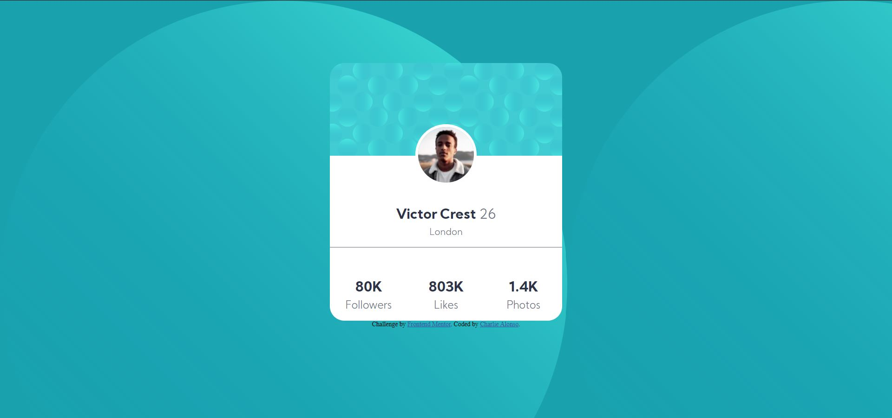

# Frontend Mentor - Profile card component solution

This is a solution to the [Profile card component challenge on Frontend Mentor](https://www.frontendmentor.io/challenges/profile-card-component-cfArpWshJ). Frontend Mentor challenges help you improve your coding skills by building realistic projects. 

## Table of contents

- [Overview](#overview)
  - [The challenge](#the-challenge)
  - [Screenshot](#screenshot)
  - [Links](#links)
- [My process](#my-process)
  - [Built with](#built-with)
  - [What I learned](#what-i-learned)
  - [Continued development](#continued-development)
- [Author](#author)

**Note: Delete this note and update the table of contents based on what sections you keep.**

## Overview

### The challenge

- Build out the project to the designs provided

### Screenshot



### Links

- Solution URL: [https://github.com/Charlie025x/profile-card-component.git](https://github.com/Charlie025x/profile-card-component.git)
- Live Site URL: [https://charlie025x.github.io/profile-card-component/](https://charlie025x.github.io/profile-card-component/)

## My process

### Built with

- Semantic HTML5 markup
- CSS custom properties
- CSS Grid
- Mobile-first workflow

### What I learned

Getting the card's images to overlap the way I wanted them to was difficult. In the end I made the blue texture a background image of the grid cell and I positioned profile picture using "position: relative".

```css
.profilePic {
    position: relative;
}
```
I'm still having trouble with the background svg.

### Continued development

I need to work on posistion SVGs

## Author

- Website - [Charlie](https://github.com/Charlie025x)
- Frontend Mentor - [@Charlie025x](https://www.frontendmentor.io/profile/Charlie025x)
